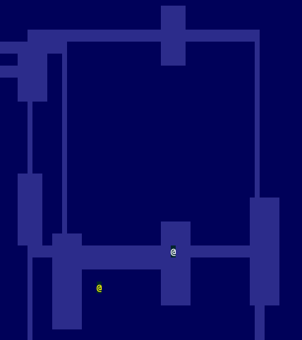

Roguelike 

Participating in the 4th anual code-along series of roguelikes on [/r/roguelikedev](https://old.reddit.com/r/roguelikedev/wiki/python_tutorial_series#wiki_directory_of_participants).

* [Part 1](http://rogueliketutorials.com/tutorials/tcod/v2/part-1/) - ~~Drawing the ‘@’ symbol and moving it around~~
* [Part 2](http://rogueliketutorials.com/tutorials/tcod/part-2/) - ~~The generic Entity, the render functions, and the map~~
* [Part 3](http://rogueliketutorials.com/tutorials/tcod/part-3/) - ~~Generating a dungeon~~
* Part 4 - Field of view
* Part 5 - Placing enemies and kicking them (harmlessly)
* Part 6 - Doing (and taking) some damage
* Part 7 - Creating the Interface
* Part 8 - Items and Inventory
* Part 9 - Ranged Scrolls and Targeting
* Part 10 - Saving and loading
* Part 11 - Delving into the Dungeon
* Part 12 - Increasing Difficulty
* Part 13 - Gearing up

## Screenshot

### Part-3

Generating a dungeon

### Part-2

The generic Entity, the render functions, and the map

### Part-1

Drawing the ‘@’ symbol and moving it around